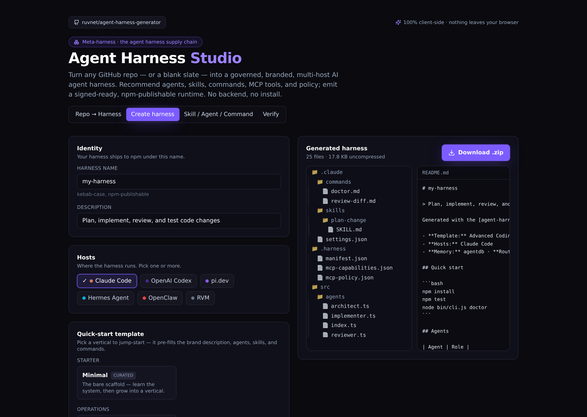
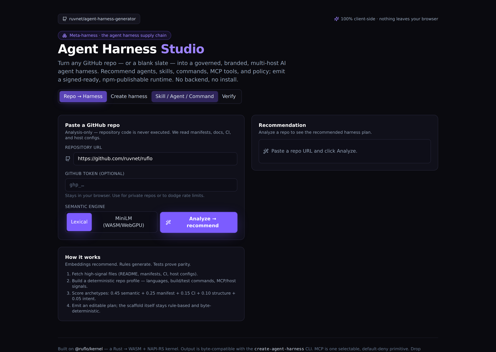
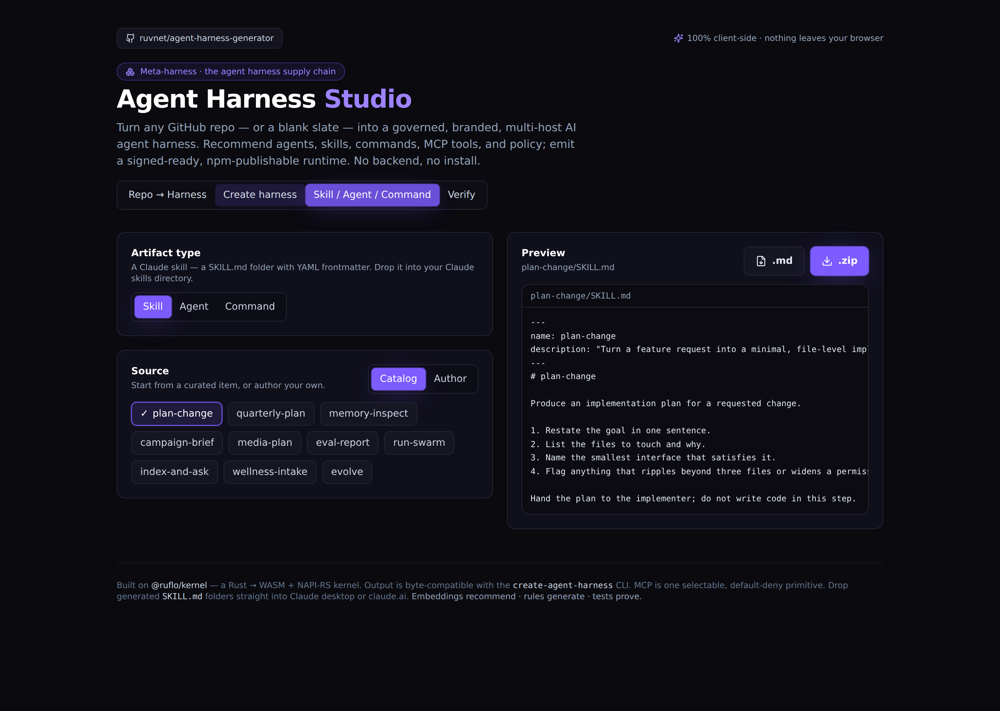
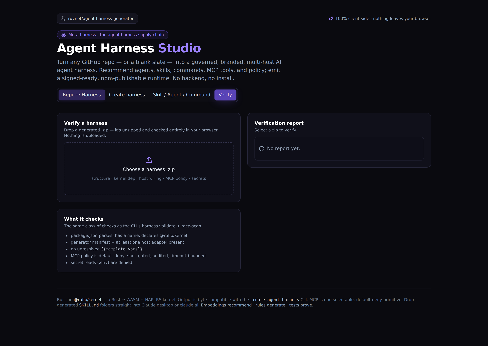

# Agent Harness Studio — Web UI

A **100% client-side** Studio for the agent-harness supply chain: turn any GitHub repo (or a blank slate) into a governed, branded, multi-host AI agent harness — recommend, build, verify, ship. No backend, no install, nothing leaves your browser. Deployable to GitHub Pages; desktop- and mobile-friendly.

> Design: [ADR-020](../../docs/adrs/ADR-020-web-generator-ui.md) · [ADR-021](../../docs/adrs/ADR-021-client-side-packaging-and-pages-deploy.md) · [ADR-022 (MCP)](../../docs/adrs/ADR-022-mcp-primitive.md) · [ADR-023 (Repo→Harness)](../../docs/adrs/ADR-023-repo-to-harness-importer.md) · [ADR-024 (Studio+Verify)](../../docs/adrs/ADR-024-studio-and-verify.md)



## Four tabs

| Tab | What you get |
|---|---|
| **Repo → Harness** | Paste a GitHub URL → deterministic analysis (languages, build/test commands, MCP/host/CI signals) → archetype scoring → an editable harness plan with a confidence panel. No repo code executed; suggested commands are `trust: inferred · execution: disabled`. Semantic engine: **Lexical** (default) or optional **MiniLM** embeddings (Transformers.js, WebGPU/WASM, lazy-loaded, lexical fallback). |
| **Create harness** | 16 quick-start verticals, composable agents/skills/commands, kernel options, and the **Primitives** panel (CLI · MCP · memory · learning · witness · release gates). Live file tree + `<name>.zip`. |
| **Skill / Agent / Command** | Author or pick a single Claude artifact → drop-in `SKILL.md` folder (YAML frontmatter). |
| **Verify** | Drop a generated `.zip` → unzipped + checked in-browser (structure, kernel dep, host wiring, unresolved vars, MCP policy, secrets). |

<p align="center">
  
  
  
</p>

## MCP — modular, gated, security-first

MCP is one selectable primitive (`off` / `local` / `remote`), default-deny. Enabling it emits `src/mcp/{server,tools,resources,prompts,policy,audit}.ts` (+ `auth.ts` remote) and a scannable `.harness/mcp-policy.json`. Safe defaults: no network/shell/file-write, approve-dangerous, 30 s timeout, 8 calls/turn, audit on. See [ADR-022](../../docs/adrs/ADR-022-mcp-primitive.md) and the CLI's `harness mcp-scan`.

## Develop

```bash
cd apps/web-ui
npm install
npm run dev        # http://localhost:5173 (served at root)
```

## Test · bench · screenshots

```bash
npm test           # 48 generator unit tests (Vitest)
npm run e2e        # Playwright — desktop + mobile, zero console errors
npm run bench      # generator hot-path micro-bench (sub-100µs/op, 2ms budget)
npm run shot       # regenerate the README screenshots
```

## Build & deploy

```bash
npm run build              # base = /agent-harness-generator/ (GitHub Pages)
VITE_BASE=/ npm run build  # base = / (custom domain or root)
```

Pushing changes under `apps/web-ui/**` to `main` triggers [`pages.yml`](../../.github/workflows/pages.yml): unit + e2e gates, then deploy. A red gate blocks the deploy. Vendor chunks (`react`, `zip`) are split from app code for CDN caching.

## How it stays faithful

- **Generator parity** — `src/generator/render.ts` is a behaviour-for-behaviour port of the CLI renderer; templates/agents/skills/commands come from the generated `src/generated/catalog.ts` (single source of truth in `packages/create-agent-harness/templates/catalog.def.mjs`).
- **Determinism** — `analyzeFiles` / `recommendPlan` / `buildScaffold` are pure; the same repo at the same commit yields the same plan and the same zip bytes (fixed-date archive). Proven by a determinism test.
- **Invariant** — embeddings recommend, rules generate, tests prove parity.

## Security note (dev-only)

`npm audit` reports advisories in the **dev** toolchain (esbuild → vite → vitest); the esbuild one is a dev-server issue. None of these ship in the static GitHub Pages build — the deployed artifact contains no esbuild/vite runtime. The fix is a breaking `vite@8` bump, deferred. The product's security model (default-deny MCP, `mcp-scan`, in-browser Verify, witness signing) is unaffected.

## Layout

```
apps/web-ui/
├─ src/
│  ├─ generator/            # framework-free generator core (pure + tested)
│  │  ├─ render.ts          # {{var}} renderer + name validation (CLI parity)
│  │  ├─ catalog.ts         # re-exports the generated catalog + HOSTS
│  │  ├─ artifacts.ts       # single Claude SKILL.md / agent / command builders
│  │  ├─ scaffold.ts        # full harness file tree
│  │  ├─ mcp.ts             # MCP primitive (ADR-022)
│  │  ├─ repo.ts            # Repo → Harness analyzer + archetypes (ADR-023)
│  │  ├─ verify.ts          # in-browser harness verifier (ADR-024)
│  │  ├─ zip.ts             # JSZip + Blob download (deterministic)
│  │  └─ __tests__/         # 48 unit tests
│  ├─ generated/catalog.ts  # GENERATED — do not edit (npm run gen:templates)
│  ├─ components/           # HarnessBuilder, ArtifactBuilder, RepoImporter, VerifyPanel, FileTree, ui
│  └─ App.tsx
├─ e2e/                     # Playwright desktop + mobile specs
└─ scripts/                 # screenshot.mjs, bench.mjs
```
