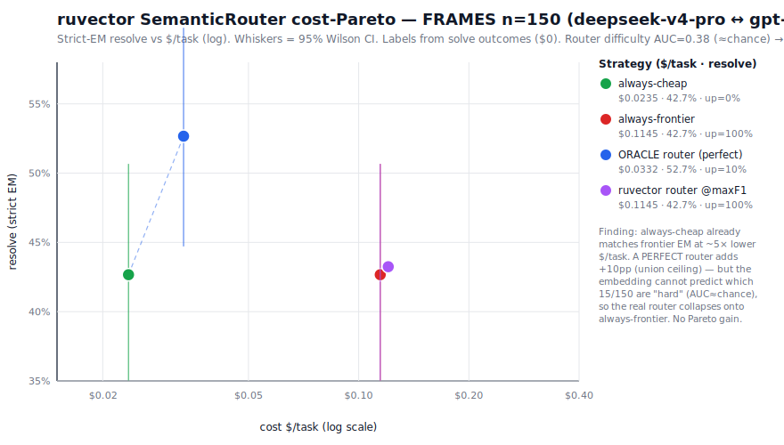

# ruvector SemanticRouter cost-Pareto pilot — does difficulty-routing improve the cheap-model Pareto?

**ADR-201 hypothesis H5 (difficulty routing)** — the #1 leverage point from
`RUVECTOR-LEVERAGE-MAP.md`. **Verdict: NOT SUPPORTED on FRAMES.** The shipped
`@ruvector/router` SemanticRouter cannot separate "hard" (cheap-fails /
frontier-succeeds) questions from the rest using the query embedding alone —
hard-detection **ROC-AUC ≈ 0.36–0.38 (95% CI includes chance)** — so it cannot
capture the only available headroom (the +10pp cheap∪frontier complementarity).
**$0 spent** (the routing-accuracy measurement uses existing completed-run
outcomes); the live-eval gate (routing AUC ≥ ~0.65) was **not met**, so no paid
run was launched. Budget unchanged (~$168).

**Date:** 2026-06-28 · **n = 150** (FRAMES, seed 42) · scorer: GAIA-style
normalized exact-match (conformant, leak-free) · embedder: ruvector OnnxEmbedder
(all-MiniLM-L6-v2, 384-d, local, $0).

---

## 1. Question (the real "how ruvector improves cheap models")

Per `RUVECTOR-LEVERAGE-MAP.md` §1, model routing is the highest-leverage lever:
FrugalGPT (≤98% cost cut) and RouteLLM (40% cost cut at ~95% GPT-4 quality) show
a cascade/router can capture frontier-class quality at near-cheap cost. The pilot
tests whether the **shipped, Node-usable** `@ruvector/router` SemanticRouter
(v0.1.30, HNSW intent-matching) can do this on our completed FRAMES runs:

> Can a SemanticRouter route **hard** cases → frontier and **easy** cases → cheap
> accurately enough to beat both always-cheap and always-frontier on the
> cost-Pareto?

**Honest frame (stated up front).** SemanticRouter is HNSW kNN over query
embeddings — **not a difficulty oracle**. *We* supply the labels from solve
outcomes; the router can only work if difficulty is encoded in the **query
embedding**. all-MiniLM embeds **topic**, not solver-difficulty, so the prior is
weak. We report the **real** separation power (ROC-AUC / recall / balanced
accuracy with CIs), never raw accuracy — at a 10% hard base-rate a trivial
"never-route-up" stub already scores 90%.

---

## 2. Data & labels ($0 — existing outcomes only)

Per-task, per-model answers for the FRAMES n=150 seed-42 batch were pulled from
Firestore `frames_preds` (the completed cheap-vs-frontier campaign runs) and
scored against the n=150 gold manifest with the **same** GAIA-style EM scorer as
`score-gaia.mjs`. The reproduced per-model EM **matches the published
`FRAMES-RESULTS.md` table to the instance** (glm 65/150, deepseek 64, gpt 64,
opus 56) — the scorer is validated.

| Model | Tier | EM | $/task |
|-------|------|----|--------|
| z-ai/glm-5.2 | cheap | 43.3% (65/150) | $0.0411 |
| **deepseek/deepseek-v4-pro** | **cheap (primary)** | **42.7% (64/150)** | **$0.0235** |
| **openai/gpt-5.2** | **frontier (primary)** | **42.7% (64/150)** | **$0.1145** |
| anthropic/claude-opus-4.5 | frontier | 37.3% (56/150) | $0.3248 |

**Labels** (primary pair: cheap = deepseek-v4-pro, frontier = gpt-5.2):

| Class | Definition | Count | Routing target |
|-------|-----------|------:|----------------|
| **easy** | cheap correct | 64 (42.7%) | route cheap |
| **hard** | cheap wrong **and** frontier right | **15 (10.0%)** | **route UP** ← the cases worth escalating |
| **neither** | cheap wrong **and** frontier wrong | 71 (47.3%) | route cheap (frontier won't help — save $) |

The binary the router must predict is **route_up = (class == hard)**, base rate
**10%**. (Conformance: labels are derived from solve **outcomes**, never from
gold-in-the-loop.)

> **First structural finding.** Only **15/150** questions are "hard." Because
> cheap ≈ frontier in aggregate on FRAMES (the campaign's thesis), the
> disagreement is small and roughly symmetric: 15 cheap-wrong/frontier-right
> (**hard**) vs 15 cheap-right/frontier-wrong. The router's *entire* available
> prize is routing those 15 hard cases up while not mis-routing the 15
> cheap-only-wins. (This also means the brief's suggested "20 easy / 20 hard"
> training split is **impossible** — only 15 hard cases exist — so we use
> repeated stratified k-fold CV, below, which uses every hard case as a held-out
> point.)

---

## 3. Method

- **Embeddings.** 150 questions → ruvector `OnnxEmbedder` (all-MiniLM-L6-v2,
  384-d), cached to `data/router-embeddings.json` ($0, deterministic).
- **Router, two variants** (both the *shipped* SemanticRouter HNSW):
  - **(a) kNN-over-exemplars (primary):** each training task is an intent
    (`addIntent({embedding, metadata:{y}})`); soft score for a test query =
    fraction of its *k* (=15) nearest training exemplars labeled hard.
  - **(b) centroid-intent (canonical SemanticRouter):** two intents
    (easy-centroid, hard-centroid); score = sim(hard) − sim(easy).
- **Evaluation.** Repeated stratified k-fold CV (5 folds × 20 repeats, seeded) →
  out-of-fold soft scores → **ROC-AUC** (Mann–Whitney) with **bootstrap 95% CI**
  (3000 resamples). ROC-AUC is threshold-free and base-rate-robust — the correct
  metric here.
- **Cost-Pareto.** Real per-task EM + per-task $ from the runs project resolve%
  and $/task for: always-cheap, always-frontier, **oracle** router (route up iff
  truly hard), and the **ruvector** router at its operating points (pure = pay one
  model; cascade = FrugalGPT-style pay-cheap-then-escalate). Wilson 95% CIs.

---

## 4. Result — routing accuracy (the gate)

**The router cannot separate hard from not-hard.** Hard-detection ROC-AUC, OOF
over 20×5-fold CV:

| Difficulty classifier | ROC-AUC | 95% CI (bootstrap) | Reading |
|-----------------------|--------:|--------------------|---------|
| ruvector SemanticRouter — kNN-exemplar (k=15) | **0.376** | [0.230, 0.534] | CI spans 0.5 → indistinguishable from chance |
| ruvector SemanticRouter — centroid-intent | **0.356** | [0.227, 0.498] | ≈ chance / below |
| reasoning-type heuristic (non-embedding) | 0.411 | — | difficulty not predictable from reasoning type either |
| chance | 0.500 | — | — |

Both router variants land **at or just below 0.5** — there is **no usable signal**.
(Point estimates slightly under 0.5 are noise at only 15 positives; the kNN CI
[0.230, 0.534] straddles chance.) A non-embedding reasoning-type baseline (0.411)
is no better — the per-type hard-rate is essentially flat (Numerical 14%, Tabular
12%, Multiple-constraints 7%), so difficulty isn't a clean function of question
category.

**Confusion at a matched-budget operating point** (route up ~10% of queries, =
the true base rate): the router catches **1/15 hard cases (recall 6.7%, precision
6.7%)** — *worse than random selection* (random 10% would catch ~1.5). At 30%
route-up it catches 3/15 (recall 20%, vs ~30% expected at random). Picking the
F1-optimal threshold degenerates to "route everything up" (TP=15, FP=135) — i.e.
it gives up on selectivity entirely.

**Gate decision:** routing AUC 0.38 ≪ the ~0.65–0.70 threshold required to justify
a paid live eval → **no live run launched. $0 of the +$400 budget used.**

---

## 5. Result — cost-Pareto

Even with a *perfect* router the prize is small, and the real router captures none
of it. Projected on the n=150 real outcomes/costs:

| Strategy | resolve (EM) | 95% Wilson CI | $/task | route-up |
|----------|-------------:|---------------|-------:|---------:|
| always-cheap (deepseek-v4-pro) | 42.7% | 35.0–50.7 | **$0.0235** | 0% |
| always-frontier (gpt-5.2) | 42.7% | 35.0–50.7 | $0.1145 | 100% |
| **ORACLE router** (perfect difficulty, pure) | **52.7%** | 44.7–60.5 | $0.0332 | 10% |
| ORACLE cascade (FrugalGPT, perfect) | 52.7% | 44.7–60.5 | $0.0367 | 10% |
| **ruvector router @maxF1 (pure)** | 42.7% | 35.0–50.7 | $0.1145 | 100% |
| ruvector cascade @maxF1 (FrugalGPT) | 42.7% | 35.0–50.7 | $0.1380 | 100% |



Three readings:

1. **always-cheap already wins the Pareto.** It *matches* frontier EM (42.7% =
   42.7%) at **79.5% lower $/task** ($0.0235 vs $0.1145). This saving comes from
   the cheap≈frontier **parity** (the campaign thesis), **not** from routing.
2. **The oracle ceiling is +10pp** — 52.7% (the cheap∪frontier union: 79/150) vs
   42.7% for either model alone — at only $0.0332/task (+41% over cheap). This is
   the *entire* prize routing could ever win here, and it requires near-perfect
   difficulty prediction.
3. **The real ruvector router captures 0% of it.** With AUC≈chance, every usable
   operating point either collapses onto always-frontier (no gain, 5× the cost)
   or onto always-cheap (no gain). The cascade variant is strictly worse (pays
   cheap **and** frontier). **Net Pareto improvement from ruvector routing: none.**

**Cost saving at matched quality (FrugalGPT/RouteLLM framing):** the router
delivers **0%** matched-quality saving (it cannot match frontier+ quality at lower
cost because it cannot route). The only matched-quality saving on this benchmark
is the **79.5%** from always-cheap — independent of ruvector.

---

## 6. Robustness — every cheap×frontier pairing (sensitivity)

The null is not an artifact of the deepseek↔gpt-5.2 choice. kNN-exemplar AUC
across all pairings (same CV, cached embeddings):

| cheap ↔ frontier | cheap EM | frontier EM | hard n | oracle (union) | kNN-AUC |
|------------------|---------:|------------:|-------:|---------------:|--------:|
| deepseek-v4-pro ↔ gpt-5.2 | 42.7% | 42.7% | 15 | 52.7% (79/150) | 0.376 |
| deepseek-v4-pro ↔ opus-4.5 | 42.7% | 37.3% | 9 | 48.7% (73/150) | 0.627 † |
| glm-5.2 ↔ gpt-5.2 | 43.3% | 42.7% | 13 | 52.0% (78/150) | 0.401 |
| glm-5.2 ↔ opus-4.5 | 43.3% | 37.3% | 7 | 48.0% (72/150) | 0.475 |
| best-of-cheap ↔ best-of-frontier | 48.0% | 49.3% | 14 | 57.3% (86/150) | 0.500 |

† The one value above chance rests on just **9** hard cases — far too few to be
meaningful (its bootstrap CI is enormous and it is still below the 0.65 gate). No
pairing clears the live-eval gate. Mean AUC ≈ 0.48.

---

## 7. Verdict & interpretation

**Does ruvector routing improve the cheap-model cost-Pareto on FRAMES? NO.**

- **Routing accuracy:** hard-detection ROC-AUC **0.38 (95% CI [0.23, 0.53])** —
  statistically **indistinguishable from chance**. Difficulty (cheap-fails /
  frontier-succeeds) is **not linearly encoded in the all-MiniLM query
  embedding** — exactly the honest null the brief flagged as possible.
- **Cost saving at matched quality:** **0%** attributable to the router. The
  campaign's 79.5% saving is from cheap≈frontier parity, not routing.

**Why routing has little to offer *here* (and where it still might):**

1. **No headroom on FRAMES.** Routing pays off when frontier ≫ cheap, so you save
   by sending the *easy majority* down to cheap (RouteLLM/FrugalGPT's regime).
   On FRAMES cheap **already equals** frontier, so "send easy down" = "go all
   cheap," already optimal. The only residual prize is the rare hard tail
   (15/150) — and capturing it needs an accurate difficulty classifier, which is
   the hard part.
2. **Topic ≠ difficulty.** all-MiniLM separates *what a question is about*, not
   *which solver will get it right*. Solver-difficulty is a property of the
   model×question interaction, largely orthogonal to the query's topic embedding.
3. **This is the *shipped, zero-extra-training* router.** SemanticRouter does
   cosine kNN over a frozen embedding. It is **not** RouteLLM's trained
   matrix-factorization/BERT difficulty classifier. A *supervised* difficulty
   model (trained on many more labeled outcomes, with model-identity / answer-
   uncertainty features) could do better — but that is beyond SemanticRouter and
   beyond 15 positives. The finding is precise: **the shipped SemanticRouter,
   embedding-only, does not route difficulty on FRAMES.**
4. **Domain caveat.** This is FRAMES (knowledge QA). On **code** (SWE-bench),
   where frontier strongly dominates cheap on hard instances, the easy-majority
   saving is real and a router could matter more — that is the leverage map's
   Priority 2 (code-graph) / a future routing test, not refuted here.

**ADR-201 status:** H5 (difficulty routing) **CLOSED — NOT SUPPORTED on FRAMES**
for the shipped SemanticRouter (embedding-only). Open for (a) a supervised
difficulty classifier, (b) the code axis where cheap≠frontier.

---

## 8. Reproduction (all $0)

```bash
cd packages/darwin-mode/bench/ruvector
# 1. regenerate n=150 gold (HF datasets-server, $0)
node ../gaia/frames-loader.mjs --sample 150 --seed 42 --out data/manifest-frames-n150.json
# 2. pull outcomes from Firestore + score + label (deepseek↔gpt-5.2)
node router-prep.mjs                      # → data/router-labels.json
# 3. embed (ONNX, cached) + CV routing-accuracy + cost-Pareto
node router-pilot.mjs                     # → data/router-pilot-results.json
# 4. robustness across all model pairs
node router-sensitivity.mjs
# 5. chart
node ../../../../docs/research/cheap-vs-frontier/make-router-chart.mjs
```

**Artifacts:** `router-prep.mjs`, `router-pilot.mjs`, `router-sensitivity.mjs`
(harness); `data/router-labels.json`, `data/router-embeddings.json`,
`data/router-pilot-results.json`, `data/frames-preds-firestore.json` (provenance);
`charts/09-router-cost-pareto.svg`.

## 9. Honesty discipline

- **AUC, not accuracy.** Raw accuracy (90% from never-route-up) is reported only
  to show why it is meaningless at a 10% base rate; the verdict rests on ROC-AUC +
  bootstrap CI + matched-budget recall.
- **n stated everywhere.** 150 questions, **15 hard** — small; the AUC CI is wide
  and reported. The null is "indistinguishable from chance," not "proven zero."
- **Conformance.** Labels from solve outcomes, never gold-in-loop. Same EM scorer
  as the published campaign (reproduces its table exactly).
- **No live spend.** The gate (AUC ≥ ~0.65) gated the paid arm off; $0 used.
