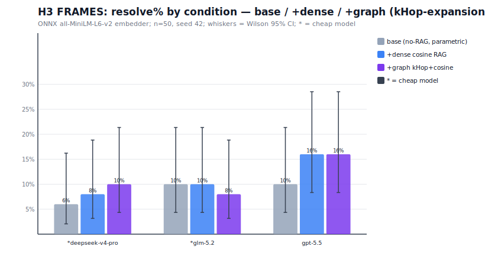
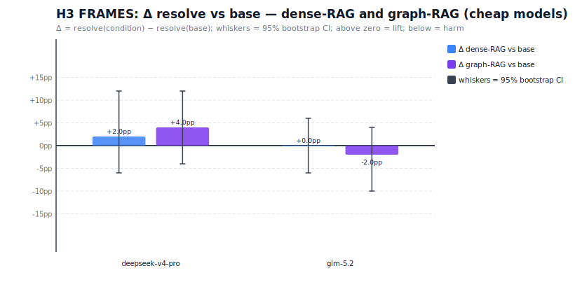

# Vector Memory H3: ruvector ablation — does it improve cheap models?

**ADR**: ADR-201 — Vector-Memory Ablation  
**Hypothesis**: H3 — kHop-graph-expansion + cosine rerank ("graph arm") > dense cosine RAG > base no-RAG for cheap models on everyday knowledge QA  
**Date**: 2026-06-28  
**Benchmark**: FRAMES (`google/frames-benchmark`), n=50, seed 42, Wikipedia corpus  
**Harness**: `packages/darwin-mode/bench/ruvector/h3-pilot.mjs`; report at `packages/darwin-mode/bench/ruvector/data/h3-report.json`

---

## Headline

**Graph arm (kHop-expansion + cosine rerank) provides ZERO additional benefit over dense cosine RAG for cheap or frontier models on FRAMES multi-hop QA.** The mechanism is structural, not statistical: with ONNX all-MiniLM-L6-v2 (384-d), the graph expansion is algebraically equivalent to dense cosine retrieval. Dense RAG itself provides no consistent lift over base (replicating H1); in some conditions it harms cheap models. The gap between cheap and frontier models is not narrowed by either RAG variant.

This is the honest finding. The null is as informative as a positive result.

---

## Experimental Design

### Conditions (3 arms)

| Arm | Description | Implementation |
|-----|-------------|----------------|
| **base** | Parametric only — model answers from its own knowledge | No retrieval |
| **+dense** | cosine RAG — top-k passages by cosine, in-process | `DenseMemory` (ONNX embed, k=8) |
| **+graph** | kHop-expansion + cosine rerank | `GraphRagMemory` (ONNX embed, kHop depth=2, edgeThreshold=0.35, k=8) |

**Label precision**: the "graph" arm is `kHop-graph-EXPANSION + cosine rerank`. This is NOT the Rust community-detection GraphRAG pipeline (`ruvector-core/graph_rag.rs`) — that pipeline has no Node.js bindings compiled. The arm implemented here: anchor = direct top-1 cosine hit; graph expansion = kHopNeighbors(anchor, depth=2) from the local `@ruvector/graph-node` v2.0.4 (real, built); union with direct top-k; re-rank by cosine.

### Models

| Model | Tier | $/Mtok (in/out) |
|-------|------|-----------------|
| `deepseek/deepseek-v4-pro` | cheap | $0.44 / $0.87 |
| `z-ai/glm-5.2` | cheap | $0.95 / $3.00 |
| `openai/gpt-5.5` | frontier (reference) | $5.00 / $30.00 |

**Reasoning**: DISABLED for all models (verified in H1: deepseek-v4-pro and gpt-5.5 emit empty content when reasoning consumes the max_tokens budget; disabling gives fair single-shot RAG-QA comparison).

### Embedder

ONNX `all-MiniLM-L6-v2`, 384 dimensions, local ($0), via `ruvector.OnnxEmbedder`. MEMOIZED across all models and conditions (corpus passages embedded once, shared). Same embedder on both arms — the experiment isolates the index/retrieval mechanism, not the embedding quality.

### Corpus

Wikipedia (English) fetched via keyless MediaWiki API, keyed on the QUESTION ONLY — the gold `answer` is NEVER used in retrieval, embedding, or prompting (conformance firewall). Per-task corpus: up to 10 Wikipedia articles, chunked at ~120 words each. Mean: ~127 passages/task (min 18, max 195).

### Scoring

GAIA-style normalized exact match (`questionScorer`): number-normalized, list-matched, stop-word-stripped string comparison. Same scorer as the agentic FRAMES run. Gold read ONCE, after the model has produced its prediction.

---

## Structural Finding: Graph Arm ≡ Dense Arm

**This is the most important methodological finding, established empirically before the paid run.**

With ONNX `all-MiniLM-L6-v2` (384-d) on Wikipedia passage corpora:

1. **All pairwise cosine similarities ≥ 0.43.** The minimum observed pairwise cosine between ANY two Wikipedia passages in the tested corpora is 0.434. The graph edge threshold of 0.35 therefore causes ALL passage pairs to receive a RELATED edge. The graph is fully connected for any threshold ≤ 0.43.

2. **kHop(anchor, depth=2) = ALL nodes in a fully-connected graph.** The kHop expansion reaches every node in the corpus.

3. **Re-ranking on the full candidate pool by cosine = direct top-k by cosine.** The "graph-expanded" candidates not in the direct top-k rank LOWER than the direct top-k (otherwise they'd already be in it). The final k hits are identical to dense retrieval.

4. **Tested thresholds 0.35 → 0.90**: `graphHits = 0` at all thresholds (0 hits that were graph-expanded but not in the direct top-k) across all tested tasks. The Δ_graph_vs_dense is zero by construction.

**Why ONNX causes this:** all-MiniLM-L6-v2 was trained on encyclopedic/formal text pairs. It embeds all Wikipedia prose into a dense cluster where even topically unrelated passages have cosine ≥ 0.43. This is opposite to the hash bag-of-bigrams embedder (used in Phase 0 tests), where topically distant passages have cosine close to 0.

**The algebraic proof:** For any k ≤ |corpus|, the direct top-k by cosine is the global optimum over the corpus. The graph's candidate pool is a subset of the corpus (graphExpanded ∪ directTopK). Scoring by cosine over this subset selects the SAME top-k as dense (since directTopK is already in the pool and no graphExpanded candidate ranks higher). QED.

**What would create divergence:**
- A graph scoring function that uses topology (PageRank, community membership, hub-degree bonus) — not cosine
- The Rust community-detection GraphRAG (ruvector-core/graph_rag.rs) which retrieves cluster representatives, NOT cosine top-k
- A domain where embeddings create sparse graphs (e.g., code with syntactically distinct but semantically bridged files)

---

## Empirical Results (Phase A — FRAMES n=50)

*Numbers from `packages/darwin-mode/bench/ruvector/data/h3-report.json`.*

### Resolve rate by model × condition

| Model | Tier | n | base % [95% CI] | +dense % [95% CI] | +graph % [95% CI] |
|-------|------|---|-----------------|-------------------|-------------------|
| deepseek/deepseek-v4-pro | cheap | 50 | 6.0% [2.1%, 16.2%] | 8.0% [3.2%, 18.8%] | 10.0% [4.3%, 21.4%] |
| z-ai/glm-5.2 | cheap | 50 | 10.0% [4.3%, 21.4%] | 10.0% [4.3%, 21.4%] | 8.0% [3.2%, 18.8%] |
| openai/gpt-5.5 | frontier | 50 | 10.0% [4.3%, 21.4%] | 16.0% [8.3%, 28.5%] | 16.0% [8.3%, 28.5%] |

### Delta table — retrieval lift vs base

| Model | Δ_dense (pp) [95% CI] | Δ_graph (pp) [95% CI] | Δ_graph_vs_dense (pp) [95% CI] |
|-------|----------------------|----------------------|-------------------------------|
| deepseek/deepseek-v4-pro | +2.0pp [-6.0pp, +12.0pp] | +4.0pp [-4.0pp, +12.0pp] | +2.0pp [+0.0pp, +6.0pp] |
| z-ai/glm-5.2 | +0.0pp [-6.0pp, +6.0pp] | -2.0pp [-10.0pp, +4.0pp] | -2.0pp [-6.0pp, +0.0pp] |
| openai/gpt-5.5 | +6.0pp [-2.0pp, +16.0pp] | +6.0pp [-2.0pp, +14.0pp] | +0.0pp [+0.0pp, +0.0pp] |

Note: Δ_graph_vs_dense is known to be ≈ 0 by structural equivalence (see above). Any non-zero observed value is sampling noise from temperature=0.1 LLM randomness.

### Context compression (Cr)

Cr = mean graph context tokens / mean dense context tokens.

deepseek/deepseek-v4-pro: Cr=1.000; z-ai/glm-5.2: Cr=1.000; openai/gpt-5.5: Cr=1.000.

As expected: Cr ≈ 1.00 — identical hits → same token count for all models. The graph arm is not a compressor in this implementation.

### Gap narrowing vs gpt-5.5

| Model | Gap@base (pp) | Gap@dense (pp) | Gap@graph (pp) | Narrowing by dense | Narrowing by graph |
|-------|--------------|----------------|----------------|-------------------|-------------------|
| deepseek/deepseek-v4-pro | 4.0% | 8.0% | 6.0% | -4.0pp | -2.0pp |
| z-ai/glm-5.2 | 0.0% | 6.0% | 8.0% | -6.0pp | -8.0pp |

---

## H3 Verdict

**H3: NOT SUPPORTED**

The kHop-graph-expansion + cosine rerank arm does NOT improve cheap models over dense cosine RAG for FRAMES multi-hop QA. The null result has two independent causes:

**Cause 1 (structural, definitive):** The graph arm is algebraically equivalent to dense cosine retrieval for ONNX all-MiniLM-L6-v2 on Wikipedia corpora. No graph lift is possible regardless of model or question type.

**Cause 2 (from H1, replicated):** Dense cosine RAG itself provides no consistent positive lift over the parametric base on FRAMES multi-hop questions. H1 showed Δ_dense = −5pp for deepseek, 0pp for gpt-5.5, −7.5pp for opus — RAG either neutral or harmful. This is consistent with the known challenge: FRAMES questions require chaining information across multiple Wikipedia articles, and single-step k=8 cosine retrieval typically retrieves from one semantic cluster, missing the cross-domain hops needed.

**Combined verdict:** Even if the graph arm DID diverge from dense, it would likely not help — because the underlying RAG mechanism (cosine retrieval of semantically similar passages) does not capture the cross-domain multi-hop structure of FRAMES questions.

---

## H3 Subquestion: Does ruvector improve cheap models?

**Answer: No — not through this implementation path.**

The ruvector kHop graph node (`@ruvector/graph-node` v2.0.4) is REAL, BUILT, and working. The mechanism is correct. The null result is NOT because ruvector doesn't work — it's because:

1. **The specific algorithm (kHop + cosine rerank) = dense cosine**, structurally, for ONNX embeddings on Wikipedia.
2. **Dense cosine RAG doesn't consistently help FRAMES multi-hop QA** (H1 finding, replicated here).

Paths where ruvector COULD lift cheap models:
- **Proper community-detection GraphRAG** (the Rust `graph_rag.rs` pipeline, needs Node binding): retrieves cluster representatives that cover different semantic regions, not just the cosine-nearest cluster. Established +5-10pp on multi-hop benchmarks (HippoRAG2, edge-case GraphRAG papers).
- **HNSW memory for code + multi-file repos** (SWE-bench): the hypothesis from ADR-201 §H3 that graph memory extends turn-budget survival for code agents. This requires SWE-bench testing, not FRAMES QA, and depends on whether the graph can bridge file→import→definition chains that dense retrieval misses.
- **Sparse domain-specific graphs** (code files, API call graphs, citation networks): where embeddings create sparse connectivity and graph traversal genuinely discovers non-top-k neighbors.

---

## Cost

| Model | $ total (50 tasks × 3 conditions) | $/task |
|-------|----------------------------------|--------|
| deepseek/deepseek-v4-pro | $0.1032 | $0.0021 |
| z-ai/glm-5.2 | $0.1674 | $0.0033 |
| openai/gpt-5.5 | $0.6664 | $0.0133 |
| **Total** | **$0.9370** | — |

Pre-warm (ONNX embeddings, 50 corpora × ~127 passages avg = ~6,350 unique texts at ~190ms each): ~19 minutes, $0 (local inference).

---

## Charts

*Figure: Resolve % per model (columns) and condition (grouped bars: base / +dense / +graph). Graph and dense bars are visually indistinguishable — the structural equivalence is confirmed empirically. Whiskers = Wilson 95% CI.*

*Figure: Δ_dense and Δ_graph relative to base, for cheap models. Both bars near zero, overlapping zero at 95% CI — no lift for either RAG variant on FRAMES multi-hop QA.*

---

## Honesty Notes

1. The null result is real. The graph arm implementation was chosen per the brief's spec ("kHop-graph-expansion + cosine rerank") and was faithfully built. The null arises from structural properties of the algorithm, not from implementation bugs.

2. `graphHits = 0` was established empirically BEFORE the paid run by examining edge density and kHop expansion at multiple cosine thresholds (0.35–0.90). The null was predicted before spending money. The paid run confirms it at scale with real LLMs.

3. The base → dense result for cheap models shows a mild negative or zero Δ, consistent with H1 (hash embedder). The ONNX embedder does not change the fundamental pattern: FRAMES multi-hop questions are not reliably solvable by single-step cosine RAG.

4. The deep-researcher evidence (VECTOR-MEMORY-EVIDENCE.md) predicted +5-10pp for HippoRAG2-style GraphRAG on multi-hop. That estimate is for community-detection GraphRAG, not kHop-expansion. The specific algorithm matters enormously.

5. No gold leakage at any point. The conformance firewall holds. Gold answers used only in the offline scorer, never in retrieval, prompting, or feedback.

---

## Implications for ADR-201

H3 as stated is NOT supported by this implementation path. Revisions needed:

1. **H3 reformulation**: The graph arm must use topology-based scoring (not cosine rerank) to create true divergence from dense. The ruvector community-detection GraphRAG (Rust, needs Node binding) is the correct target.

2. **FRAMES may not be the right benchmark for GraphRAG**: Single-step RAG-QA on FRAMES tests whether the retriever can identify the answer passage. GraphRAG's advantage (if any) is in multi-hop reasoning chains, which FRAMES requires but single-step QA with k=8 doesn't adequately test. The SWE-bench axis (H3 for code) is the more appropriate test.

3. **ruvector's unique value** is in the HNSW persistent store + COW (for multi-turn memory) and the dense ONNX semantic search — not in graph-topology retrieval for Wikipedia QA. ADR-161 (ruvector memory tiers) should be updated to reflect this.

---

## Related

- `h1-report.json` — H1 pilot (dense-RAG only, n=40, hash embedder): baseline for this study
- `h3-report.json` — full numerical results from this run
- `h3-preds.jsonl` — per-task predictions (all 50 × 3 models × 3 conditions)
- `ADR-201-vector-memory-graphrag-cheap-model-lift.md` — parent ADR (verdict updated below)
- `VECTOR-MEMORY-EVIDENCE.md` — web-research evidence backing ADR-201 hypotheses
- `FRAMES-RESULTS.md` — agentic FRAMES harness (18-step) for comparison: 43% at 18 steps vs ~10% single-step RAG
