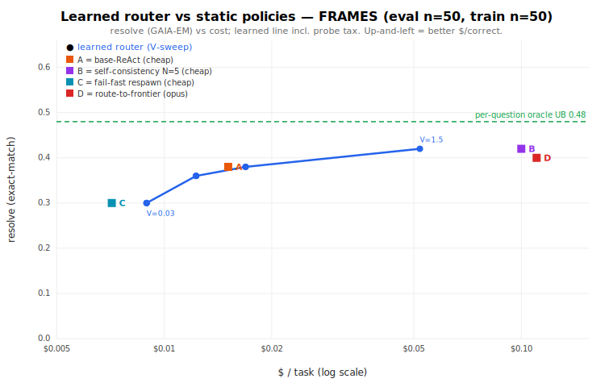

# Does a learned adaptive policy beat the best static one? — the capstone test of "smarter orchestration, not smarter execution"

**Question.** The whole campaign argued the lever is the *harness*, not the weights. The scaffolding ablation found that no single scaffold reliably lifts a cheap model's accuracy (and several backfire); the cheap-vs-frontier work found cheap≈frontier on everyday QA but a real gap on hard items. If "smarter orchestration" is real, the place it should pay off is a **learned, context-aware router** that sends each query to the right arm — cheap for easy, expensive only where it earns its price. This experiment builds that router and asks the capstone question head-on: **on a held-out split, does a learned adaptive policy beat the best *static* policy on accuracy-per-dollar (or Pareto: more resolve at lower cost)?**

**TL;DR verdict — a split decision, reported straight.**
- **On accuracy: NO.** The learned router never exceeds the best static's resolve (it ties it). At n=50 every resolve difference is inside the Wilson noise band — no policy, learned or static, is significantly more accurate than any other.
- **On cost-efficiency (Pareto): YES, modestly and specifically.** The learned router achieves the **best static's top accuracy (0.42) at 48% lower cost** ($0.052 vs $0.100/task) by spending the expensive self-consistency arm *only* on the bucket where it helps and using cheap base-ReAct elsewhere. It strictly **Pareto-dominates two of the four static policies** (self-consistency and frontier).
- **The lever the priors flagged — route hard→frontier — did NOT materialize**, because on this everyday-QA harness the frontier (opus-4.8) barely out-resolved the cheap model (eval 0.40 vs 0.38; *worse* than cheap on train). The cost-aware bandit correctly **learned to never pay for the frontier**. The routing win that *did* appear is the cheaper lever: selective scaffold spend, not model upgrade.
- **Net:** "smarter orchestration" buys you **the same accuracy cheaper**, not **more accuracy** — exactly consistent with the ablation (scaffolds don't raise cheap-model accuracy) and the cheap≈frontier prior (no frontier gap to exploit on everyday work).

---

## 1. Design

**Dataset.** FRAMES (`google/frames-benchmark`), the open GAIA-class multi-hop QA proxy, **n=100, seed 42**. Split by manifest order: **TRAIN = tasks[0:50]** (the policy's learning set, gold rewards) and **EVAL = tasks[50:100]** (held-out; the policy picks arms by *context only*, gold scores afterward).

**The four arms the policy selects per query** (the menu; cheap model = `deepseek/deepseek-v4-pro`, frontier = `anthropic/claude-opus-4.8`):

| Arm | Policy | Mechanism | Harness |
|-----|--------|-----------|---------|
| **A** | base-ReAct (cheap) | the bounded search→open→submit loop, 1 sample | `solve-gaia --scaffold none`, 12-step |
| **B** | self-consistency N=5 (cheap) | 5 sampled episodes, majority vote | `solve-gaia --scaffold verifier-bon --samples 5`, score `majority_answer` |
| **C** | fail-fast respawn (cheap) | 2-step episode, drop + respawn on empty (≤2) — ultra-cheap, shallow | `solve-gaia --scaffold failfast --short-steps 2 --respawns 2` |
| **D** | route-to-frontier | base-ReAct on opus-4.8 | `solve-gaia --model anthropic/claude-opus-4.8`, 10-step |

**Context (pre-solve, gold-free).** A cheap **probe** (`probe.mjs`) runs **3 direct no-tool answers** from the cheap model (temp 0.7) and extracts: question length (`q_words`), **self-consistency** (max agreement across the 3 samples), self-rated confidence, and a textual multi-hop score. Buckets = `length{short,long} × consistency{lo,mid,hi}` with a global-pool fallback for sparse buckets. The probe is the router's **routing tax** ($0.0031/query) and is charged to the learned policy; static policies pay no probe.

**The policy engine.** A **context-bucketed, two-signal Thompson-Sampling bandit** (`bandit.mjs`): per (bucket, arm) it keeps a *safety* Beta(α,β) over P(correct) and a *cost* EMA, and selects by the scalarized utility `U = θ·V − costEma` (θ ~ Beta; `V` = the $-value of a correct answer, the accuracy↔cost exchange knob). This is the **`@ruvector/rvf-solver` PolicyKernel algorithm, reimplemented — *not* the npm package.** The package (`@ruvector/rvf-solver@0.1.8`) is **puzzle-train-locked**: its `train({count,minDifficulty,maxDifficulty})` generates and solves its *own* internal puzzles, the arms are hard-wired skip-modes (`none|weekday|hybrid`), and there is no public method to register external context/arms or feed external rewards. So we reimplemented its documented model (safety Beta + cost EMA, 18→6 context buckets) faithfully. (Verified by self-test: on a synthetic world it routes easy→cheap, hard→frontier and beats both statics.)

**Reward (two-signal).** accuracy (GAIA-style strict exact-match via gold) + cost ($, from OpenRouter `usage.cost`). **Conformance:** gold is read *only* by the offline scorer, after each arm produced its answer; the EVAL arm choice is `bandit.choose(bucket)` — context only, never gold. TRAIN uses gold as the learning signal; EVAL uses it only to score the chosen arm.

**Baselines.** always-A, always-B, always-C, always-D; the **oracle best-fixed arm** (the single arm with the best TRAIN resolve, applied blind to EVAL); and the **per-question oracle** (EVAL upper bound — cheapest correct arm per question).

**Reasoning OFF** throughout (no reasoning API param), matching all prior FRAMES runs.

---

## 2. Results (FRAMES, EVAL n=50, train n=50, seed 42, reasoning OFF)

### Static baselines

| Policy | resolve (EM) | Wilson 95% | $/task | $/correct |
|--------|:---:|:---:|:---:|:---:|
| **A — base-ReAct (cheap)** | 0.38 | [0.259, 0.519] | $0.0151 | $0.040 |
| **B — self-consistency N=5 (cheap)** | **0.42** | [0.294, 0.558] | $0.0999 | $0.238 |
| **C — fail-fast respawn (cheap)** | 0.30 | [0.191, 0.438] | $0.0071 | **$0.024** |
| **D — route-to-frontier (opus-4.8)** | 0.40 | [0.276, 0.538] | $0.1103 | $0.276 |
| oracle best-fixed arm (=B, chosen on train) | 0.42 | [0.294, 0.558] | $0.0999 | $0.238 |
| **per-question oracle (EVAL upper bound)** | **0.48** | — | $0.0136 | **$0.028** |

Two facts dominate everything below: **(1) the frontier barely helps** — opus (0.40) is +2pp over cheap base (0.38) on eval and *behind* it on train (0.38 vs 0.48) — and **(2) the per-question oracle (0.48) routes 32/50 to the *cheapest* arm C and only 3/50 to frontier.** The accuracy headroom is in routing *cheap*, not in buying frontier.

### The learned router's frontier (V-sweep, incl. probe tax)

| V (correct-value) | resolve | Wilson 95% | $/task | $/correct | arm mix (A/B/C/D) |
|:---:|:---:|:---:|:---:|:---:|:---:|
| 0.03–0.08 | 0.30 | [0.191, 0.438] | $0.0089 | $0.030 | 0 / 0 / 50 / 0 |
| 0.12–0.25 | 0.36 | [0.241, 0.499] | $0.0123 | $0.034 | 24 / 0 / 26 / 0 |
| 0.4–0.7 | 0.38 | [0.259, 0.519] | $0.0169 | $0.044 | 50 / 0 / 0 / 0 |
| **1.5** | **0.42** | [0.294, 0.558] | **$0.0520** | $0.124 | 24 / 26 / 0 / 0 |

**The headline comparison — learned at V=1.5 vs the statics it Pareto-dominates:**

| | resolve | $/task | $/correct |
|---|:---:|:---:|:---:|
| **Learned router (V=1.5)** | **0.42** | **$0.052** | **$0.124** |
| always-B (best static) | 0.42 | $0.100 | $0.238 | → **same resolve, −48% cost** |
| always-D (frontier) | 0.40 | $0.110 | $0.276 | → **+2pp resolve, −53% cost** (strict domination) |



**Fig 1 — Resolve vs $/task (log x).** Up-and-left is better. The blue learned frontier sweeps from all-C (cheap, bottom-left) to the A/B mix (top). It sits *on or left of* the static points B and D — it reaches their accuracy for less money — but its top **never rises above the best static's resolve**, and the dashed per-question-oracle line (0.48) sits well above the whole achievable set.

**Across the sweep, the only point that Pareto-dominates a static is V=1.5** (it dominates both B and D). At the cheap end the learned router and the cheapest static (C) are a wash on $/correct ($0.028 vs $0.022) — once you pay the probe tax, the static cheap arm is marginally better.

### What the policy learned

Train resolve by arm: **A 0.48, B 0.52, C 0.34, D 0.38.** The bandit's posterior utilities therefore rank **B ≳ A ≫ C, with D dominated by A** (similar accuracy, 7× the cost). Consequently **the learned policy never routes a single query to the frontier (D) at any V** — cost-aware Thompson refused to pay opus prices for +2pp. At the accuracy-favoring end (V=1.5) it routes 26 queries to B (SC5) and 24 to A (base) across the two populated buckets (short|lo, long|lo), capturing B-level accuracy while paying for SC5 on only ~half the queries.

**The context signal was weak.** The cheap model's 3-sample self-consistency almost always *scattered* on these hard multi-hop questions (nearly every query bucketed `consistency=lo`), so routing collapsed to mostly **question length**. That is why the router stalls at 0.42 and leaves the 0.48 per-question-oracle headroom on the table: it lacked a discriminative difficulty signal to find the easy questions that C/A could solve cheaply.

---

## 3. Verdict — does adaptive beat static, and via what?

**Does the learned policy beat the best static?**
- **On accuracy-per-dollar / Pareto: YES, narrowly.** It matches the top static accuracy (0.42) at **48% lower cost** and strictly dominates the frontier and self-consistency statics. The win is **real on the cost axis** (cost is measured exactly, not noisy).
- **On raw accuracy: NO.** It ties — and cannot exceed — the best static's resolve, and at n=50 *no* policy beats *any* other on resolve at the 95% level (all Wilson CIs overlap heavily).
- **On pure $/correct: a tie** with the cheapest static (C) once the probe tax is paid.

**Via what mechanism does the (cost) win come?** **Selective spend + cost-aware avoidance**, *not* model-upgrade routing and *not* scaffold-selection raising accuracy:
- It learned to **never route to the frontier** — the one lever the priors predicted (hard→frontier) had no exploitable gap because **frontier ≈ cheap on this everyday-QA harness** (consistent with `../cheap-vs-frontier/REPORT.md`).
- The accuracy ceiling is set by the arms themselves: no scaffold lifts cheap-model accuracy here (consistent with `../scaffolding/SCAFFOLDING-ABLATION.md`), so a router over those arms inherits the ceiling. **Adaptive routing reallocates *cost*, it does not manufacture *intelligence*.**

This is the honest capstone answer: **smarter orchestration delivers the same accuracy more cheaply, not more accuracy** — on everyday QA, where there is no frontier gap to route toward.

---

## 4. Honesty & limits

- **Statistical power.** EVAL n=50. *Every* resolve difference (learned vs any static) is within the Wilson band — the accuracy story is "no significant difference," and the *cost* story (exact $ at matched resolve) is the only robust quantitative win. Treat all resolve deltas as directional.
- **The frontier arm may be under-served.** D (opus-4.8) ran at a **10-step cap** (vs 12 for cheap) and under strict GAIA exact-match, which can penalize a verbose frontier model; opus scoring *below* deepseek on train (0.38 vs 0.48) is suspicious and partly a harness/EM artifact, not necessarily true model quality. So the "frontier routing doesn't pay" finding is specific to *this harness's* frontier yield; a better-served frontier arm could change it. The broader cheap≈frontier-on-everyday-QA prior still predicts a small gap.
- **Weak context signal.** 3-sample cheap self-consistency was nearly uninformative on hard FRAMES (almost all `lo`); buckets collapsed toward question-length. A stronger difficulty estimator (e.g., retrieval-hit features, larger probe, an entropy signal) is the obvious next lever to capture the 0.48 oracle headroom — flagged, not done.
- **Absolute scores are low (~0.3–0.4)** because the harness uses lightweight keyless-Wikipedia retrieval; only **same-harness relative** comparisons are valid (not external FRAMES leaderboards ~0.65–0.70). Routing/cost deltas are measured *within* this harness.
- **Offline full-information training.** The bandit observed all four arms on every TRAIN item (we logged the full matrix), so the per-bucket posterior is exact; the EVAL policy is the greedy posterior (exploit). This is the data-efficient instantiation of the rvf two-signal model; it is not an online-regret demonstration (the included Thompson `sample()` path supports that, used only in the self-test).
- **rvf-solver provenance.** We used the **algorithm, not the package** — `@ruvector/rvf-solver@0.1.8`'s public surface is puzzle-train-locked and cannot accept external arms/rewards (stated plainly so as not to overclaim package use).
- **Conformance.** Gold never enters any solve or the routing decision; it is read only by the offline scorer. The probe never sees gold. EVAL arms are chosen by context only.
- **Spend.** OpenRouter account meter **$2682.94 → $2714.81 = +$31.87**, within the authorized **+$40** (account-gate `--abort-usage 2722` armed on every paid call; the hard ceiling $2839 was never approached). The rate-limited SC5 arm (B) was the cost/time tail (a few hard questions burned the full 5×12 steps at ~$0.22 each).

---

## 5. Reproduce

```bash
cd packages/darwin-mode/bench/orchestration

# 0) bandit self-test ($0, deterministic): easy→cheap, hard→frontier, beats statics
node --experimental-strip-types bandit.mjs --selftest

# 1) the four arms + probe on FRAMES n=100 (budget-gated; D is the cost driver)
#    (manifest: ../gaia/manifest-frames-n100.json, seed 42)
OPENROUTER_API_KEY=$KEY node --experimental-strip-types probe.mjs   --samples 3 --meter --abort-usage 2722 --out runs/probe.jsonl
cd ../gaia
OR=anthropic/claude-opus-4.8
node --experimental-strip-types solve-gaia.mjs --manifest manifest-frames-n100.json --scaffold none         --model deepseek/deepseek-v4-pro --meter --abort-usage 2722 --out ../orchestration/runs/preds-A.jsonl
node --experimental-strip-types solve-gaia.mjs --manifest manifest-frames-n100.json --scaffold verifier-bon --samples 5 --model deepseek/deepseek-v4-pro --meter --abort-usage 2722 --out ../orchestration/runs/preds-B-final.jsonl
node --experimental-strip-types solve-gaia.mjs --manifest manifest-frames-n100.json --scaffold failfast --short-steps 2 --respawns 2 --model deepseek/deepseek-v4-pro --meter --abort-usage 2722 --out ../orchestration/runs/preds-C.jsonl
node --experimental-strip-types solve-gaia.mjs --manifest manifest-frames-n100.json --scaffold none --max-steps 10 --model $OR --meter --abort-usage 2722 --out ../orchestration/runs/preds-D.jsonl

# 2) train the bandit on TRAIN, evaluate learned-vs-static on held-out EVAL
cd ../orchestration
node --experimental-strip-types learn-eval.mjs --train-n 50 --out runs/learned-eval.json
# 3) chart
node --experimental-strip-types make-chart.mjs --in runs/learned-eval.json --out ../../../../docs/research/orchestration/charts/01-learned-vs-static.svg
```

*Generated 2026-06-28 from `packages/darwin-mode/bench/orchestration/runs/learned-eval.json` (FRAMES eval n=50, train n=50, seed 42, 12-step cheap / 10-step frontier, reasoning OFF; cheap=deepseek-v4-pro, frontier=opus-4.8). Policy engine: rvf-solver two-signal Thompson-Sampling algorithm, reimplemented.*
