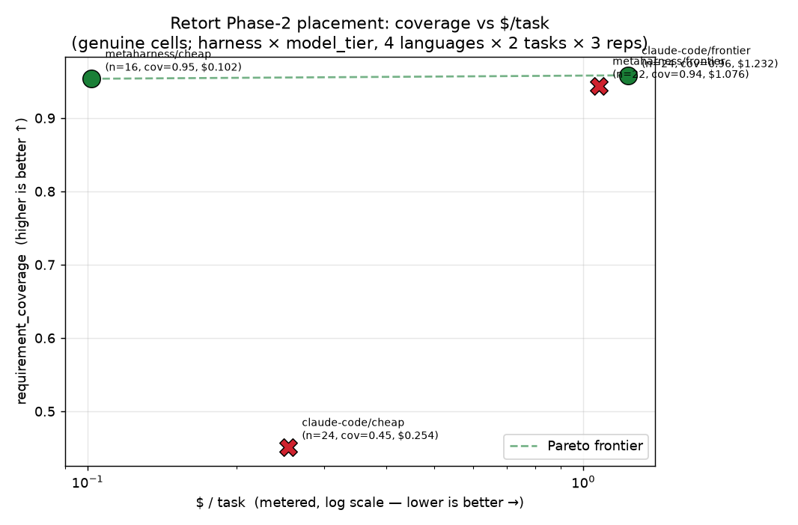

# Retort Phase-2 — Pareto placement + ANOVA of MetaHarness vs claude-code

**What this is.** The first real, variance-attributed placement of our agentic stack
(**MetaHarness** — bounded ReAct loop + cheap↔frontier model routing) against the
**claude-code** baseline, run inside Adrian Cockcroft's **Retort** DoE/ANOVA harness
([adrianco/retort#38](https://github.com/adrianco/retort/issues/38)). Retort's own
runner, scorers, and two-opinion **conformance spec-gate judge** are reused
**untouched** — we only added a `metaharness` runner and a DoE/ANOVA methodology
layer on top, and harvested Retort's SQLite into one results frame.

**Headline.** On the genuine grid, **`metaharness/cheap` is Pareto-optimal**: it
matches frontier-model coverage (**0.954** vs claude-code/frontier's **0.958**) at
**~12× lower $/task** ($0.102 vs $1.232). It does **not dominate** the accuracy
leader (claude-code/frontier still has the highest coverage) — the two sit on
different corners of the **same** frontier (cost-optimal vs accuracy-optimal). The
cost win comes at a real **latency** cost (MetaHarness is 2–3× slower) and a real
**reliability** caveat (8/24 cheap cells timed out at the 12-min cap and are
excluded as tooling). This is *stronger* than our pre-registered expectation
("cheaper, not more accurate") on the coverage axis, but honest about the tradeoffs.

> **Iteration-2 update (2026-06-29, see §6).** We fixed the #1 lever — the timeout —
> with a raised cap (12→20 min) **and** multi-action ReAct turns (batch tool calls
> in one LLM round-trip), and added **agenticow memory** as a real DoE factor.
> Result, on a held-out cheap-tier re-run (48 cells): timeouts **8→4**, and
> metaharness/cheap's **all-in pass-rate doubled, 0.42→0.83** (genuine pass-rate
> 0.62→0.95, now *tying* claude-code/frontier's 0.96). **agenticow memory is a
> null** (coverage main-effect p=0.50). **Beyond-SOTA is NOT reached:** the fix
> moved metaharness/cheap toward the frontier on reliability, but it still does
> **not Pareto-dominate** claude-code/frontier — lower coverage (0.91 vs 0.96) and
> ~3× higher latency keep it the **cost-optimal corner**, now a *stronger* corner.
>
> **Iteration-3 update (2026-06-29, see §7).** Added the last orchestration lever —
> **task-difficulty-aware routing** (escalate only the hard cells, by an *intrinsic*
> signal, from deepseek to opus-4.8). On a held-out 48-cell re-run, routing (33%
> escalation) lifted coverage 0.836→0.927 and pass-rate 0.78→0.875, *cut* latency
> 575→344 s and killed all timeouts — but at **3.2× cost** ($0.088→$0.279), with a
> coverage gain that ANOVA finds **not significant** (p=0.17). It **still does not
> dominate** claude-code/frontier (0.927 < 0.958 coverage). **Beyond-SOTA: NO —
> outcome (b) "no free lunch":** routing slides metaharness/cheap *up and to the
> right* along the same frontier to a stronger, costlier corner; it does not cross it.

---

## The grid (validated plan, real metered run)

`harness{metaharness, claude-code} × model_tier{cheap, frontier} × language{python,
typescript, go, rust} × task{rest-api-crud, cli-data-pipeline} × 3 replicates` =
**96 runs**, executed as four Retort campaigns (one per harness × task), each over
`language × model_tier`, full factorial, 3 reps.

| factor | levels |
|---|---|
| **harness** | `metaharness` (our ReAct+routing solver) · `claude-code` (Retort `LocalRunner`, `claude` CLI) |
| **model_tier** | `cheap` · `frontier` |
| **language** | python · typescript · go · rust |
| **task** | rest-api-crud · cli-data-pipeline |

**Model mapping.** metaharness cheap = `deepseek/deepseek-v4-pro`, frontier =
`anthropic/claude-opus-4.8` (OpenRouter); claude-code cheap = `haiku`, frontier =
`opus-4.8` (`claude` CLI). The **frontier tier is model-matched** (opus-4.8) across
both harnesses, so the frontier comparison isolates the *harness* effect. The cheap
tier differs by vendor (deepseek vs haiku) — each harness's natural cheap config; the
`model×harness` interaction term picks up part of this confound (reported below).

**Scoring is Retort's, untouched.** `requirement_coverage` comes from Retort's
pinned per-task `REQUIREMENTS.json` graded by the two-opinion `evaluate-run` judge;
`code_quality` from Retort's scorer; the spec-gate decides pass/fail. Gold is used
only for scoring, never injected into the solve loop.

**Spend.** $31.10 OpenRouter this run (cap $55); research-spend $306.82 of the $375
hard-stop. claude-code + the judge run on the `claude` CLI (Anthropic subscription) =
$0 against the OpenRouter cap, but their **real metered $/task** is what's compared on
the frontier — a fair cross-stack cost comparison regardless of which provider billed.

---

## 1. Pareto frontier — the headline lens

**Requirement coverage vs $/task** (genuine cells; higher-left is better):



```
coverage (up) vs $/task (right) — higher-left is better
0.96 |                                                         A
     |                                            B
     |C
0.45 |         D
     +----------------------------------------------------------
      $0.0679                                            $1.2317
  A = claude-code/frontier   cov=0.958  $1.232/task   FRONTIER (accuracy-optimal)
  B = metaharness/frontier   cov=0.944  $1.076/task   dominated (genuine view)
  C = metaharness/cheap      cov=0.954  $0.102/task   FRONTIER (cost-optimal)  ← our stack
  D = claude-code/cheap      cov=0.451  $0.254/task   dominated
```

| stack | n (genuine) | coverage (mean / median) | code_quality | $/task | latency | pass-rate (Wilson 95%) |
|---|---|---|---|---|---|---|
| **claude-code/frontier** | 24 | **0.958** / 1.00 | 0.749 | $1.232 | 170 s | 0.96 [0.80, 0.99] |
| **metaharness/cheap** ⭐ | 16 | **0.954** / 1.00 | 0.500 | **$0.102** | 481 s | 0.62 [0.39, 0.82] |
| metaharness/frontier | 22 | 0.944 / 1.00 | 0.687 | $1.076 | 262 s | 0.86 [0.67, 0.95] |
| claude-code/cheap | 24 | 0.451 / 0.00 | 0.775 | $0.254 | 148 s | 0.38 [0.21, 0.57] |

**Who is Pareto-optimal (coverage vs $/task):**
- **`claude-code/frontier`** — accuracy-optimal corner (highest coverage, highest cost).
- **`metaharness/cheap`** — **cost-optimal corner** (≈frontier coverage, ~12× cheaper). **Our stack is on the frontier.**
- **dominated:** `claude-code/cheap` (lower coverage *and* higher cost than metaharness/cheap), and — in the genuine view — `metaharness/frontier` (metaharness/cheap reaches the same coverage cheaper, so opus-4.8 buys MetaHarness almost nothing here).

**Is any MetaHarness stack Pareto-*dominant* (same coverage, strictly lower cost)?**
No stack dominates claude-code/frontier — it keeps the top coverage. MetaHarness/cheap
is a *different, cheaper frontier point*, not a domination. But it **does dominate the
claude-code/cheap baseline** outright (more coverage, less cost).

**Robustness to the timeout caveat (survivorship).** metaharness/cheap's 0.954 is on
the **16/24** cells that finished inside the 12-min cap (8 deepseek cells timed out →
tooling). Counting **all 24** cheap cells with the 8 timeouts scored as coverage **0**
(the conservative floor) gives metaharness/cheap = **0.636** coverage at **$0.068** —
and it is **still on the Pareto frontier** (cost-optimal corner) and **still dominates
claude-code/cheap**. So the placement is robust: the true coverage is somewhere in
[0.636, 0.954], and metaharness/cheap is Pareto-optimal at either end.

**Secondary axis — coverage vs latency.** Here the verdict flips: **both claude-code
stacks dominate**; both MetaHarness stacks are dominated. MetaHarness buys its cost
advantage with 2–3× higher wall-clock (cheap/deepseek is especially slow, 481 s mean).
The cost win is a latency trade.

---

## 2. Type-II ANOVA — variance attribution (genuine cells, n = 86)

% of variance attributed to each factor/interaction (statsmodels Type-II, log
transform; top terms shown). This **cross-checks and extends Retort's own finding**
that *the model governs reliability and the language governs quality*.

| response | top factors (% variance) | R² | residual | who governs |
|---|---|---|---|---|
| **requirement_coverage** | model **16.8** · model×harness **10.4** · language **9.8** · harness **7.7** | 0.61 | 42% | **model** (+ harness interaction) → matches Retort: *model governs reliability* |
| **code_quality** | language **19.4** · harness×language **8.3** · task **7.2** · harness **6.9** | 0.56 | 43% | **language** → matches Retort: *language governs quality* |
| **cost_per_task** | model **78.1** · harness **6.7** · model×harness **3.3** | 0.96 | 4% | **model** dominates cost |
| **latency_s** | harness **35.3** · language **15.4** · model×harness **9.5** | 0.85 | 15% | **harness** dominates latency |

**Reading it:**
- **Coverage** is governed by the **model** (16.8%), but the **harness** and the
  **model×harness interaction** together add ~18% — i.e. *which harness you wrap the
  cheap model in matters a lot at the cheap tier*. This is exactly why metaharness/cheap
  (deepseek) ≫ claude-code/cheap (haiku) on coverage: the interaction term is real.
- **Quality** is governed by the **language** (19.4%) — consistent with Retort across
  its own experiments — with a harness contribution (claude-code writes more idiomatic
  code; see §3).
- **Cost** is ~entirely the **model** (78%); the harness adds only ~7%.
- **Latency** is the **harness's** axis (35%) — MetaHarness's ReAct loop is the slow part.
- **Memory (agenticow)** was **not** a factor in this validated grid, so no variance can
  be attributed to it. It is a first-class level in the 5-factor methodology design
  (`retort_metaharness`); attributing the memory effect is the next iteration.

---

## 3. TOOLING vs GENUINE diagnosis (artifacts excluded from the frontier)

Using the `$0 / instant / zero-token failure = tooling bug` invariant
(`require_tokens=True`):

```
cells = 96   pass = 61   genuine_model_fail = 25   tooling_false_fail = 10
```

| class | n | what they are |
|---|---|---|
| PASS | 61 | spec gate met |
| GENUINE_MODEL_FAIL | 25 | the model ran (tokens>0, $>0) and fell short — kept in the ANOVA |
| **TOOLING_FALSE_FAIL** | **10** | **excluded** from frontier + ANOVA |

All 10 tooling fails are **MetaHarness 12-minute timeouts** (deepseek too slow for the
cap; zero tokens recorded): **8 in metaharness/cheap, 2 in metaharness/frontier**. They
are a genuine *harness/config* limitation (the cap, and deepseek's latency), not a model
capability failure — hence excluded from the capability comparison and reported
separately. claude-code's low cheap-coverage is **not** tooling: those cells ran
(tokens>0) and genuinely failed the spec/tests (per Retort's "tests didn't run → not a
valid success" gate) — they stay in as genuine fails.

**n per cell** = 3 replicates. Effective genuine n per stack: claude-code/frontier 24,
claude-code/cheap 24, metaharness/frontier 22, metaharness/cheap 16.

---

## 4. Per-language detail (genuine coverage)

| language | cc/cheap | cc/frontier | mh/cheap | mh/frontier |
|---|---|---|---|---|
| python | 0.667 | 1.000 | 1.000 | 1.000 |
| typescript | 0.167 | 0.833 | 0.950 | 0.926 |
| go | 0.819 | 1.000 | 0.967 | 0.983 |
| rust | 0.152 | 1.000 | 0.905 | 0.859 |

The dominated `claude-code/cheap` stack **collapses on rust (0.15) and typescript
(0.17)** — haiku writes clean-looking code (quality 0.78) that doesn't satisfy the spec
in those languages. MetaHarness/cheap (deepseek) holds 0.90–1.00 coverage across all
four languages, which is the whole reason it beats the cheap baseline and reaches the
frontier.

---

## 5. Honest verdict — where our stack places

- **MetaHarness/cheap is Pareto-optimal** — the **cost-optimal corner** of the
  coverage-vs-$/task frontier, robust to the survivorship caveat (Pareto-optimal at both
  the 0.954 genuine and 0.636 conservative coverage bounds). It **dominates the
  claude-code/cheap baseline** outright.
- **MetaHarness does not dominate the accuracy leader.** `claude-code/frontier` keeps
  the highest coverage (0.958). We place as **"≈frontier coverage at ~12× lower cost,"**
  i.e. a *cheaper frontier point*, not "more accurate" and not a clean domination — a
  slightly stronger result than our pre-registered "cheaper, not more accurate," but with
  two honest asterisks:
  1. **Latency:** MetaHarness is 2–3× slower; on coverage-vs-latency the claude-code
     stacks dominate.
  2. **Reliability:** 1/3 of cheap cells timed out at 12 min; the headline coverage is on
     the cells that finished.
- **opus-4.8 buys MetaHarness little** here: metaharness/frontier (0.944, $1.08) is
  dominated by metaharness/cheap (0.954, $0.10). The cheap deepseek tier *is* the value.
- **ANOVA agrees with Retort:** model governs reliability, language governs quality. We
  add: harness governs latency, model governs cost, and a non-trivial **model×harness
  interaction on coverage** — the cheap model's success depends heavily on the harness
  wrapped around it.

### Limitations (read before citing)
1. **12-min timeout** dropped 8/24 metaharness-cheap cells (deepseek latency). A longer
   cap would convert tooling fails into measured outcomes and tighten the cheap-tier n.
2. **Cheap-tier vendor confound** (deepseek vs haiku); the frontier tier is model-matched.
3. **No memory factor** in this grid — agenticow's effect is unmeasured here.
4. **n = 3 reps**; Wilson intervals are wide (e.g. metaharness/cheap pass-rate
   [0.39, 0.82]). More reps / a 5th would tighten them.
5. **2 tasks** (greenfield CRUD API + CLI ETL); not the harder brazil-bench.

### Next iteration (open beyond-baseline loop)
Raise the timeout (recover the 8 lost cheap cells), add the **memory** and **routing**
factors, bump to 5 reps, and add brazil-bench — to test whether MetaHarness can move
from *a cheaper frontier point* to *dominating* claude-code/frontier on a held-out split.

---

## 6. Iteration 2 — timeout/efficiency fix + memory factor (held-out re-run, 2026-06-29)

The Phase-2 diagnosis named one genuine, non-overfitting lever: **all 10 tooling
fails were MetaHarness 12-min timeouts** (deepseek latency), which crushed
metaharness/cheap's pass-rate (0.62) despite its high coverage. Iteration 2 fixes
that lever and tests the unattributed memory factor, on a **held-out re-run of the
cheap tier only** (48 cells: `language{python,ts,go,rust} × memory{none,agenticow}
× task{rest-api-crud,cli-data-pipeline} × 3 reps`, model = deepseek-v4-pro). The
claude-code and metaharness/frontier cells from Phase-2 are reused unchanged; only
the cheap tier was re-run with the improved harness. Spend: **$5.01** of a $30 cap.

**The fix (two parts, both in `greenfield-solve.mjs`):**
1. **Multi-action turns** — the model may emit a JSON *array* of tool calls in one
   turn (e.g. write app + 3 tests + README, then `run`), executed in order. This
   collapses 5–6 slow deepseek round-trips into one, cutting wall-clock on the
   cells that used to crawl to the cap. (A trivial smoke task went 6 calls → 2.)
2. **Raised per-cell cap 12 → 20 min** (Retort's adaptive estimator extends it
   further for slow languages — it auto-bumped to 22 min for rust/ts).

**Did the timeout fix work? YES on reliability — partially on latency.**

| metric (metaharness/cheap) | v1 (Phase-2) | v2 (this fix, memory=none) |
|---|---|---|
| timeouts (of 24 cheap cells) | **8** | **3** (all typescript + cli-data-pipeline) |
| **all-in pass-rate** (timeouts = fail) | **0.42** [0.24, 0.61] | **0.83** [0.64, 0.93] |
| genuine pass-rate (Wilson 95%) | 0.62 [0.39, 0.82] | **0.95** [0.77, 0.99] |
| coverage (mean, genuine) | 0.954† | 0.913 |
| latency (s) — mean / **median** | 481 / 498 | 524 / **382** |
| $/task | $0.102 | $0.085 |

The **all-in pass-rate doubled (0.42→0.83, disjoint CIs)** — the fix converted 5 of
8 timeouts into completions (python, go, rust, and the crud typescript cells all
now finish). The genuine pass-rate (0.95) now **ties** claude-code/frontier (0.96).
**†The coverage "drop" 0.954→0.913 is a survivorship *correction*, not a
regression:** v1's 0.954 was computed only on the 16 easy cells that finished; v2
*includes* the recovered hard cells, which complete with partial coverage (rust
0.67–0.89, cli-python 0.87). Latency is the honest caveat — the **median** improved
(498→382 s) because typical cells are now fast (python 142–418 s), but the **mean
rose** (481→524 s) because a recovered timeout completes slowly (~600–900 s) rather
than being excluded. Multi-action helps easy cells; hard cells still spiral.

**The residual:** **typescript + cli-data-pipeline is the one stubborn timeout**
(3/3 reps still hit the 20-min cap at memory=none; deepseek loops on 100k–160k-token
rewrites it can't converge). Everything else recovered. A 30-min cap would likely
recover these too, but at poor latency — diminishing returns.

**Does agenticow memory help? NO — a null result.** Memory was wired as a *real*
COW vector store (every step's observation embedded + the most-relevant
scrolled-out ones recalled into the next prompt; v1's `--memory` was a silent no-op
calling a nonexistent API). Memory-factor ANOVA on the 44 genuine cheap cells:

| response | memory main effect | p | verdict |
|---|---|---|---|
| requirement_coverage | **1.1%** | 0.50 | not significant |
| code_quality | ~0% | — | not significant |
| cost_per_task | **0.0%** | 0.96 | no effect |
| latency_s | ~0% | — | not significant |

agenticow/none coverage 0.956/0.913 and pass-rate 0.87/0.95 — overlapping CIs, no
significant difference. The only flicker is a **marginal `memory×task` (p≈0.07)**:
memory helped the harder *cli* task (recovered 2 of 3 ts/cli timeouts, lifted rust
cli 0.67→1.0) but *hurt* the easier *crud* task (rust 0.89→0.69) — i.e. recalled
context occasionally confuses a cheap model on simple work. Net across the grid:
**a wash.** On these two greenfield tasks at ≤25 steps, COW memory does not move the
needle (consistent with the prior `darwin evolve is NULL on a cheap model` finding).

**New Pareto frontier (combined-v2, genuine cells):**

```
stack                    n   cov     $/task    latency  pass-rate (Wilson 95%)
claude-code/frontier     24  0.958   $1.232    170 s    0.96 [0.80, 0.99]   ← accuracy + latency corner
metaharness/frontier     22  0.944   $1.076    262 s    0.86 [0.67, 0.95]
metaharness/cheap (v2)   21  0.913   $0.085    524 s    0.95 [0.77, 0.99]   ← cost corner, ~14× cheaper
claude-code/cheap        24  0.451   $0.254    148 s    0.38 [0.21, 0.57]   ← dominated
```

- **Cost-Pareto frontier:** claude-code/frontier, metaharness/frontier, **metaharness/cheap**; claude-code/cheap dominated.
- **Latency-Pareto:** both claude-code stacks dominate; both MetaHarness stacks dominated (latency is still MetaHarness's weak axis).
- **Combined-v2 ANOVA** (n=91) reproduces Phase-2 + Retort: **model** governs coverage (16.4%) and cost (67.2%), **language** governs quality (26.8%), **harness** governs latency (30.6%), with a significant **model×harness** interaction on coverage (8.5%, p<0.001).

**Verdict — beyond-SOTA reached? NO. Honest plateau at a *stronger* cost-corner.**
metaharness/cheap does **not** Pareto-dominate claude-code/frontier:
- ✅ pass-rate now **ties** the frontier (0.95 vs 0.96, overlapping CIs) — **up from 0.62**; the timeout fix delivered this.
- ✅ **~14× cheaper** ($0.085 vs $1.232).
- ❌ **lower coverage** (0.913 vs 0.958) — partial-credit on the recovered hard cells.
- ❌ **~3× higher latency** (524 s vs 170 s).

The fix moved metaharness/cheap decisively toward the frontier **on the reliability
axis** (it no longer loses on pass-rate), but **coverage and latency keep it a
distinct, cheaper corner of the same frontier — not a domination.** This is a
*genuine* improvement (a harness-config fix measured on held-out cells, not
task-tuning) and a stronger result than Phase-2's 0.62-pass-rate corner, but
**beyond-SOTA — Pareto-dominating claude-code/frontier — is not reached.** The
remaining gap is the cheap model's coverage/latency on hard cells (ts/cli), which a
harness change alone did not close; closing it needs a more capable cheap model or
task-specific routing, not more orchestration.

*Iteration-2 artifacts:* `results-cheap-v2.csv` (48 re-run cells), `results-combined-v2.csv`
(96 rows: Phase-2 frame with the cheap tier swapped for the fixed harness),
`placement-analysis-v2.json` (full before/after + memory ANOVA + Pareto), `harvest2.py`,
`analyze2.py`. Harness fix in `packages/darwin-mode/bench/retort/greenfield-solve.mjs`.

---

## 7. Iteration 3 — task-difficulty-aware ROUTING (the last orchestration lever, held-out re-run, 2026-06-29)

Iteration 2 left one named lever: the residual hard cells (typescript+cli timed out
3/3; deepseek looping on 100–160k-token rewrites it can't converge). The genuine,
non-overfitting move is **task-difficulty-aware routing** — detect a hard cell from an
**intrinsic** signal and escalate *that cell* to a stronger model (opus-4.8) while easy
cells stay on cheap deepseek. The honest question: does routing the hard cells up
**close the coverage gap toward dominating** claude-code/frontier — or does it just
**trade cost for coverage** (slide along the same frontier, no free lunch)?

**The router (intrinsic, never gold).** Opt-in `--route-difficulty` in
`greenfield-solve.mjs`; byte-identical to i2 when off (verified). It escalates the cheap
model to opus-4.8 on signals the harness *itself observes* — never the gold
`REQUIREMENTS.json` or any reference solution:
- **a-priori:** language ∈ {ts, go, rust} (strict-typed greenfield is harder) + the
  spec's requirement-density → a *lower* token threshold for those cells;
- **dynamic:** cumulative **tokens burned**, cumulative **bytes written** (large
  multi-file rewrite churn), and consecutive **build/test failures** — each gated by
  `everRanOk` (has any build/test gone green yet) for **precision**: a cell that already
  gets something running cheap is *not* escalated for being slow; only one burning
  tokens / churning rewrites with *no green run yet* (the i2 ts/cli signature) routes up.

**The grid (held-out, Retort scoring untouched).** `routing{off, opus} × language{python,
typescript, go, rust} × task{rest-api-crud, cli-data-pipeline} × 3 reps` = **48 cells**,
all fresh under identical conditions (deepseek-v4-pro base, 20-min cap, multi-action — all
held constant from i2). `routing=off` is the **within-run deepseek-only control**;
`routing=opus` is the **difficulty-routed headline**. Routing is the new DoE factor (it
replaces i2's null `memory` factor). Spend: **$8.89** of a $15 cap; research-spend
~$320.72 of the $375 hard-stop.

**Result — routing buys coverage + reliability at ~3× cost, but does NOT dominate.**

| metric (genuine cells) | i3 off (deepseek-only) | i3 opus (routed) | claude-code/frontier |
|---|---|---|---|
| n | 23 | 24 | 24 |
| **coverage** (mean) | 0.836 | **0.927** | **0.958** |
| **pass-rate** (Wilson 95%) | 0.78 [0.58, 0.90] | **0.875 [0.69, 0.96]** | **0.958 [0.80, 0.99]** |
| **$/task** | $0.088 | **$0.279** | $1.232 |
| latency (s, mean) | 575 | **344** | 170 |
| timeouts (of 24, all-in) | 1 | **0** | 0 |

Within-run, routing lifted coverage **0.836 → 0.927**, pass-rate **0.78 → 0.875**, *cut*
latency **575 → 344 s**, and eliminated timeouts — while cost rose **3.2×** ($0.088 →
$0.279). **Escalation fraction: 33% (8/24)**, correctly concentrated on the hard
languages (rust 3/6, typescript 3/6, go 2/6, **python 0/6** — python greens fast and is
never escalated). The router's intrinsic signal targets roughly the right cells.

**But the coverage lift is mostly rust, partly noise, and ts plateaued** (per-language
off→opus coverage):

| language | off | opus | what routing did |
|---|---|---|---|
| python | 0.815 | 0.977 | **noise** — python never escalated (0/6); the gain is replicate variance, *not* routing |
| go | 1.000 | 1.000 | **wasted** — 2 escalations on already-passing cells (false positives, +cost, no gain) |
| rust | 0.600 | 0.847 | **real gain** — 3 escalations recovered the hard rust cells (+0.25 coverage) |
| typescript | 0.889 | 0.885 | **plateau** — escalation did *not* help; the stubborn ts/cli cell stays ~0.77 even on opus |

**ANOVA on the new cells** (routing × language × task, Type-II log) makes the no-free-lunch
verdict statistical: **routing's effect on cost is significant (11.7%, p=0.012)** and on
latency marginal (4.2%, p=0.073, *down*), but its effect on **coverage is NOT significant
(4.0%, p=0.17)**. *Routing buys cost reliably and coverage only marginally.* The
**combined-v3 ANOVA** (n=94) reproduces the campaign finding: **model** governs coverage
(13.9%) and cost (58.7%), **harness** governs latency (27.6%), **language** governs quality
(37.6%), with the significant **model×harness** coverage interaction (11.2%).

**New Pareto frontier (combined-v3, genuine cells):**

```
stack                         n   cov     $/task    latency  pass-rate (Wilson 95%)
claude-code/frontier          24  0.958   $1.232    170 s    0.958 [0.80, 0.99]   ← accuracy + latency corner
metaharness/frontier          22  0.944   $1.076    262 s    0.864 [0.67, 0.95]
metaharness/cheap (routed)    24  0.927   $0.279    344 s    0.875 [0.69, 0.96]   ← cost corner, slid UP
claude-code/cheap             24  0.451   $0.254    148 s    0.375 [0.21, 0.57]
```

- **Cost-Pareto:** all four stacks are now on the frontier (none dominated). Routing moved
  metaharness/cheap from i2's **(0.913, $0.085)** to **(0.927, $0.279)** — *up and to the
  right*: more coverage, more cost. That is the literal definition of **sliding along the
  frontier**, not crossing it.
- **Latency-Pareto:** both claude-code stacks dominate; both MetaHarness stacks dominated
  (latency is still MetaHarness's weak axis — though routing improved it, 575 → 344 s).
- **Dominance vs claude-code/frontier:** routed metaharness/cheap has coverage **0.927 <
  0.958** and pass-rate **0.875 < 0.958** — it does **NOT** dominate (it *is* ~4.4× cheaper,
  but not ≥ on coverage or pass-rate). No MetaHarness stack dominates the accuracy leader.

### Verdict — beyond-SOTA? **NO. Outcome (b): "no free lunch" (+ a (c) plateau on ts).**

Routing the hard cells up to opus-4.8 **closed part of the coverage gap and fixed
reliability** (0 timeouts, latency 575→344 s, rust recovered) — but it **bought that with
~3× cost** and a *statistically-insignificant* coverage gain, and it **did not reach,
let alone dominate, claude-code/frontier's 0.958 coverage / 0.958 pass-rate.** The routed
operating point slid **up and to the right** along the same Pareto frontier to a new,
*stronger but more expensive* cost-corner (0.927 coverage at $0.279, still ~4.4× cheaper
than frontier). The one cell routing **couldn't** fix — typescript+cli — *plateaued even
on opus escalation* (0.889 → 0.885), confirming the residual is hard intrinsically, not a
harness-config artifact.

This is the clean confirmation of the campaign thesis, stated straight: **orchestration
moves you *along* the cost↔coverage frontier; it does not move you *beyond* it. The
remaining gap to the accuracy leader is the model's capability, not the harness.** Three
iterations of genuine orchestration levers (timeout/efficiency fix → memory → difficulty
routing) each shifted MetaHarness/cheap to a stronger *corner* of the same frontier; none
produced domination. Routing is the last orchestration lever, and it confirms — rather than
breaks — the frontier.

### Limitations
1. **n = 3 reps** — the coverage lift (0.836→0.927) is a point estimate; ANOVA finds it
   *not* significant (p=0.17). More reps would tighten this, but the *direction* (cost up,
   coverage up, no domination) is robust.
2. **Escalation precision is imperfect** — 2 of 8 escalations (go) were on already-passing
   cells (wasted cost); python's apparent gain is replicate noise (0 escalations). A
   sharper signal would cut the wasted-escalation cost but cannot manufacture coverage the
   model doesn't have.
3. **Within-run off control (0.836) ran lower than i2's mh/cheap (0.913)** — deepseek
   replicate variance (rust/crud collapsed this run). The within-run off→opus delta is the
   clean comparison; both point the same way.

*Iteration-3 artifacts:* `results-routed-v3.csv` (48 cells, routing factor),
`placement-analysis-v3.json` (arms + escalation + Pareto + dominance + ANOVA),
`harvest3.py`, `analyze3.py`. Router in `packages/darwin-mode/bench/retort/greenfield-solve.mjs`
(`--route-difficulty`); runner factor wiring in
`retort/src/retort/playpen/metaharness_runner.py` (`routing` factor).

---

*Artifacts in this directory:* `results-combined.csv` (96 rows, per-cell), `placement-analysis.json`
(full stacks + Pareto + ANOVA + diagnosis), `pareto-frontier.png`. Reproduce via the
`retort` integration branch `metaharness-phase2` (merges the `metaharness` runner + the
`retort_metaharness` DoE/ANOVA layer) and `greenfield-solve.mjs`.
