# MetaHarness in motion

Follow the complete MetaHarness workflow: analyze a repository, generate an owned harness, connect a host, enforce policy, use memory and routing, evaluate changes, and ship a package.

[← Repository overview](../README.md) · [Quick start](USERGUIDE.md)

[](assets/visuals/walkthrough.svg)

**12 chapters · 96 seconds · loops automatically.** Open any chapter below to study one flow. With reduced motion enabled, the tour holds its opening scene; the individual chapters remain available.

These diagrams explain architecture and documented workflows. Moving particles illustrate control or data flow; they are not live telemetry, timing measurements, or benchmark results.

| Chapter | What it explains |
|---|---|
| [01. Begin with your repository](#analyze) | Repository analysis produces a recommendation before scaffolding. |
| [02. Compose the agent you need](#compose) | The generator turns project choices into a harness you own. |
| [03. One shared kernel](#kernel) | Generated harnesses consume a shared Rust kernel through host adapters. |
| [04. Bring your preferred host](#hosts) | The same generated harness connects through distinct host adapters. |
| [05. Give tools a policy boundary](#policy) | Tool permissions, approval rules, timeouts, and audit belong to policy. |
| [06. Keep context scoped](#memory) | Project memory and optional field memory have different setup requirements. |
| [07. Route against your quality bar](#routing) | The router selects the cheapest candidate predicted to meet the quality bar. |
| [08. Evolve the harness](#evolve) | Darwin evaluates harness changes behind sandbox and safety gates. |
| [09. Make releases reviewable](#evidence) | Validation and evidence connect generated files to a reviewable release. |
| [10. Ship it under your name](#ship) | Customize, validate, then publish the package under your chosen scope. |
| [11. Explore governed extensions](#extensions) | AVO, field memory, and ARC experiments have separate validation boundaries. |
| [12. Mint your first harness](#start) | Create a named harness with the CLI and inspect the generated project. |

<a id="analyze"></a>

## 01. Begin with your repository


`harness analyze-repo` reads repository structure and recommends a harness. Analysis does not execute repository code. Inferred build and test commands are emitted with execution disabled until explicitly trusted and enabled.

Read more: [User guide](USERGUIDE.md) · [Analyze-repo quick start](../README.md#try-it-in-30-seconds).

<a id="compose"></a>

## 02. Compose the agent you need


Use the Studio or CLI wizard to select a starting template and a host. The generated project contains agents, skills, commands, tool adapters, scoped memory configuration, governance, and provenance. Trim anything your repository does not need, then customize the package identity and behavior.

Read more: [Studio](https://ruvnet.github.io/metaharness/) · [User guide](USERGUIDE.md).

<a id="kernel"></a>

## 03. One shared kernel


The generator produces an owned harness. That harness consumes `@metaharness/kernel`, whose Rust implementation is distributed through WASM and native bindings. Host-specific behavior belongs in adapters; the kernel does not depend back on a host. The kernel supplies reusable governance, memory, routing, and witness primitives.

Read more: [Architecture](ARCHITECTURE.md) · [Kernel boundary](adrs/ADR-002-kernel-boundary.md).

<a id="hosts"></a>

## 04. Bring your preferred host


Choose the host integration your workflow needs. Claude Code and Codex use MCP surfaces; other hosts can use native extensions, skills, or CI configuration. Not every host supports MCP or the same policy controls. Prime Agent emits a sandbox-required runbook when a non-empty deny-list cannot be enforced by the host itself.

Read more: [Host matrix](../README.md#hosts) · [Host integration design](adrs/ADR-004-host-integration-model.md) · [RVM adapter](../packages/host-rvm/).

<a id="policy"></a>

## 05. Give tools a policy boundary


The MCP adapter supports off, local stdio, and authenticated remote modes. Generated policy starts with restrictive defaults and exposes the permissions and limits for review. `harness mcp-scan` performs static checks for risky grants, missing audit or timeout settings, and other policy problems; it does not run the target tools.

Read more: [MCP policy](../README.md#mcp--modular-default-deny) · [MCP design](adrs/ADR-022-mcp-primitive.md).

<a id="memory"></a>

## 06. Keep context scoped


The scaffold carries a memory namespace scoped to your harness. Experimental field memory is a separate, opt-in feature with deployment requirements for storage, a compatible adapter, and an authenticated principal verifier. It does not open storage or accept shared updates until those prerequisites are satisfied. Its illustrated vector geometry is a visual metaphor.

Read more: [Memory and features](USERGUIDE.md) · [Field-memory contract](../packages/field-memory/README.md).

<a id="routing"></a>

## 07. Route against your quality bar


`@metaharness/router` consumes query vectors and labeled evaluation examples. It predicts candidate quality and selects the cheapest model predicted to clear your configured threshold; if none does, it returns the best predicted candidate and reports whether the bar was met. The picture is illustrative and makes no universal quality or savings guarantee.

Read more: [Router API and training](../packages/router/README.md).

<a id="evolve"></a>

## 08. Evolve the harness


Darwin Mode proposes changes to the harness, tests them in a sandbox, and keeps improvements that pass its evaluation and safety gates. The model stays frozen. Generated projects expose `npm run evolve`; no-network, no-API-key defaults support bounded refactoring and tuning. Changes still need evidence; animation is not a benchmark.

```bash
cd my-bot
npm run evolve
```

Read more: [Darwin source](../packages/darwin-mode/) · [Darwin in the README](../README.md#new).

<a id="evidence"></a>

## 09. Make releases reviewable


Generated provenance records what was produced. Doctor and validation commands help keep a customized harness healthy. The repository documents CI gates for kernel tests, generator checks, security, and deterministic signed witness manifests. Consult those gates and current CI for evidence rather than treating an animated status as a test result.

Read more: [Quality gates](../README.md#quality-gates) · [Witness and provenance](adrs/ADR-011-witness-and-provenance.md).

<a id="ship"></a>

## 10. Ship it under your name


Rename and configure the generated project, keep the agents and tools your repository needs, validate it, and publish under your own package name or organization scope. Publishing is an explicit maintainer action. Consumers then use the versioned CLI you own; the generator does not silently publish a package for you.

Read more: [Customize and publish](../README.md#tune-it-to-your-project--then-ship-it-as-your-own-npm) · [User guide](USERGUIDE.md).

<a id="extensions"></a>

## 11. Explore governed extensions


AVO adds governed variation with budgets, rollback, quarantine, and replay receipts. ARC and field-memory packages remain experimental and have their own deployment and evidence requirements. The stronger AVO-class claim is gated on its preregistered unseen-task evaluation; ARC results are not claim-eligible until the documented controlled-ablation gate passes. Weight-EFT is a separate, optional model-tuning path, distinct from frozen-model Darwin evolution.

Read more: [AVO runtime](../packages/avo/README.md) · [AVO release claim gate](adrs/ADR-276-avo-release-claim-evidence-gate.md) · [ARC evidence gate](adrs/ADR-254-arc-avo-controlled-ablation.md).

<a id="start"></a>

## 12. Mint your first harness


Run the wizard for guided choices, or use a template and host explicitly. The example below generates `my-bot` for Claude Code; select `--host codex` for Codex. The Studio provides a browser workflow, and the user guide explains the generated files and commands.

```bash
npx metaharness my-bot --template vertical:coding --host claude-code
cd my-bot
npx . --help
```

Read more: [User guide](USERGUIDE.md) · [Studio](https://ruvnet.github.io/metaharness/).

## Start with MetaHarness

[Open the Studio](https://ruvnet.github.io/metaharness/) · [Read the user guide](USERGUIDE.md) · [Explore MetaHarness](https://cognitum.one/metaharness)

```bash
npx metaharness --wizard
```

## About the animations

Self-contained SVGs with native vector motion, no scripts, remote images, or external fonts. The layout uses a compact 16:9 canvas; all important content also appears as selectable text. The visual language follows RuVector: a near-black field, pale cyan geometry, mint signals, and orange trajectories. Geometric projections are visual metaphors, not claims about the underlying implementation.

The source storyboard and regeneration instructions are in [visuals/README.md](visuals/README.md).
